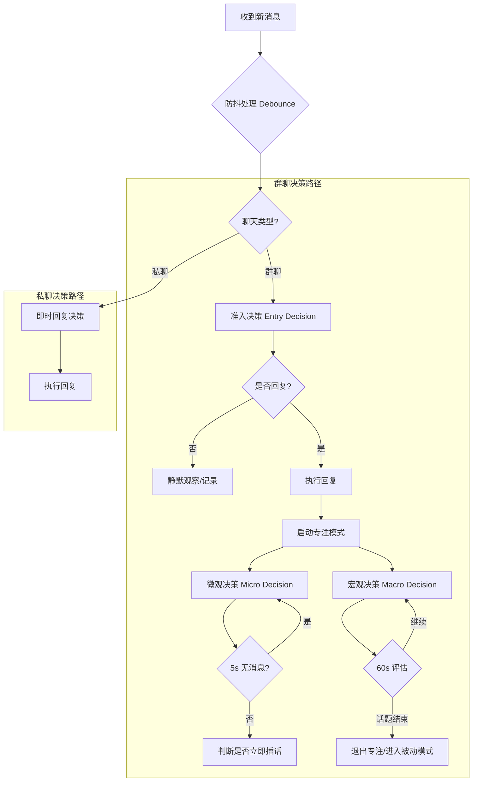
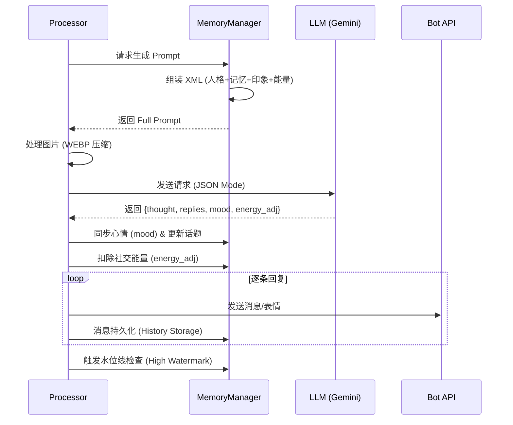
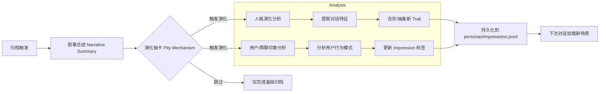
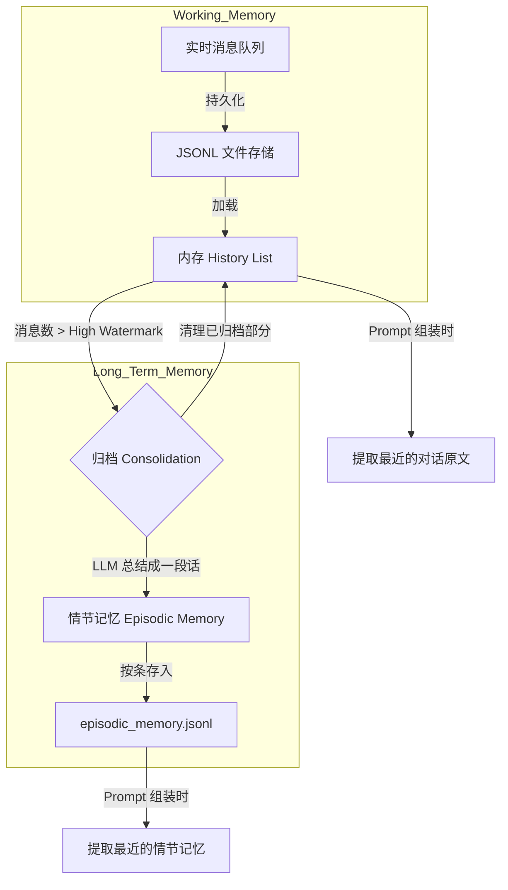

# 架构概览

Bot Agent 采用模块化设计，旨在通过清晰的职责分离提高系统的可维护性和 AI 辅助开发的效率。

## 目录结构

```text
bot_agent/
├── handlers/          # 核心业务处理逻辑
│   ├── base.py        # 基础状态定义
│   ├── processor.py   # 消息流处理器（防抖与调度）
│   ├── decisions.py   # 准入决策逻辑（是否回复、是否关注）
│   ├── reply.py       # 回复生成逻辑
│   └── ...            # 其他辅助处理模块
├── memory/            # 记忆与人格系统
│   ├── manager.py     # 记忆管理器总控
│   ├── persistence.py # 持久化处理
│   ├── logic.py       # 记忆整合与演化逻辑总控
│   ├── prompt.py      # Prompt 组装逻辑
│   └── ...            # 社交能量与 Prompt 默认值
├── monitor.py         # 监控日志记录（SQLite 写入）
├── monitor_query.py   # 监控日志查询
├── config.py          # 全局配置管理（支持动态加载与持久化）
└── llm.py             # LLM 接口层 (Gemini)
```

## 核心工作流

### 1. 决策流程建模 (Decision Workflow)
机器人的决策行为根据聊天类型（私聊/群聊）有显著差异：

- **群聊 (Group)**: 采用“三级过滤”机制（准入决策 -> 微观决策 -> 宏观决策），以模拟人类在群组中的社交带宽管理。
- **私聊 (Private)**: 直接进入即时决策，无需判断插话时机。



### 2. AI 回复建模 (AI Response Modeling)
不论何种决策路径，最终生成回复的流程是一致的。回复包含多模态处理（图片压缩）、情感状态同步和社交能量消耗。



### 3. AI 自动更新建模 (Evolution Modeling)
当对话积累到一定量时，机器人会分析交互并自动生成新的性格特质或对用户的印象。



### 4. 记忆维持建模 (Memory Maintenance)
采用“潮汐归档”机制，通过工作记忆与情节记忆的分层来处理长文本。



## 设计原则

- **XML 语义化**: 所有的 Prompt 部分（人格、历史、情节记忆）均包裹在显式的 XML 标签中。
- **状态持久化**: 机器人重启后能恢复所有运行状态、社交能量和人格进度。
- **非阻塞 I/O**: 充分利用 `asyncio` 确保高并发场景下的响应性能。
